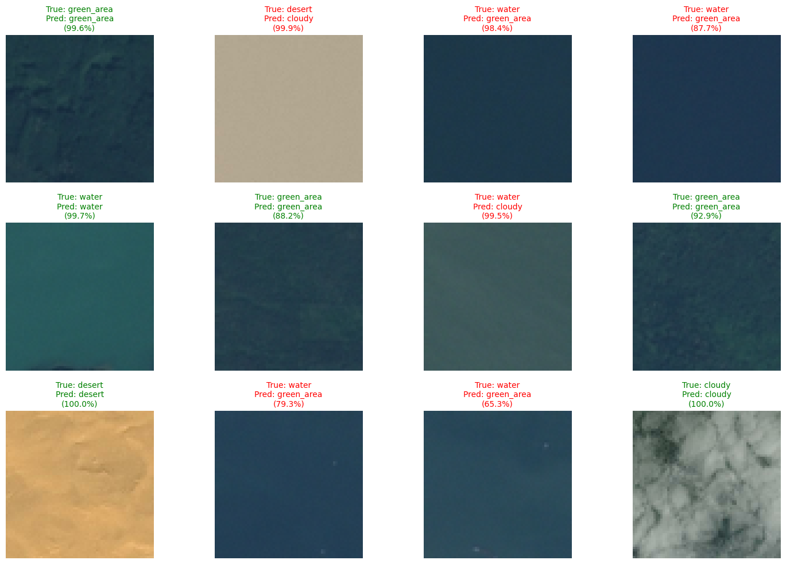
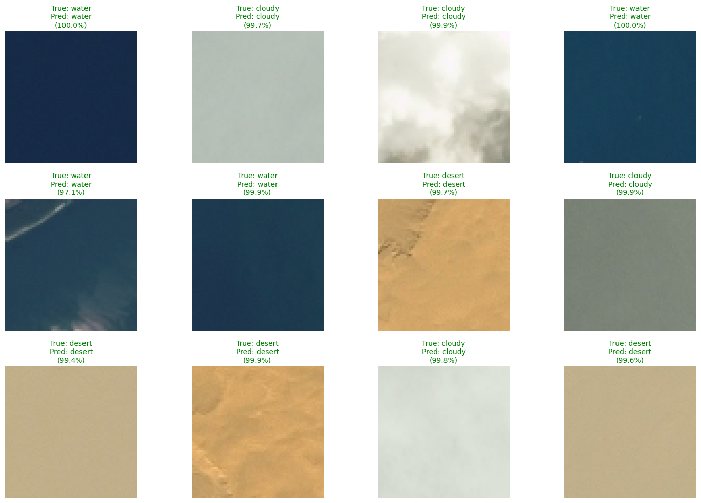

# Satellite Image Classification using CNN

A comprehensive deep learning project that implements and compares multiple Convolutional Neural Network (CNN) architectures for satellite image classification. This project demonstrates the impact of data augmentation, normalization, and architectural design choices on model performance.

## Problem Description and Motivation

Satellite imagery analysis is crucial for Earth observation, urban planning, environmental monitoring, and disaster response. Automated classification of satellite images into land cover categories enables rapid assessment of geographic regions and resource allocation optimization.

**Key Objectives:**
- Develop accurate CNN models for multi-class satellite image classification
- Compare baseline and augmented model architectures to understand the impact of data augmentation
- Evaluate model generalization and robustness on unseen test data
- Provide insights into feature learning through convolutional filter visualization

## Dataset Description

### Source
- **Dataset Name:** Satellite Image Classification
- **Source:** [Kaggle - mahmoudreda55/satellite-image-classification](https://www.kaggle.com/datasets/mahmoudreda55/satellite-image-classification)
- **Download Method:** KaggleHub Python API

### Dataset Specifications
- **Image Size:** 64 × 64 pixels (RGB color images)
- **Classes:** Multiple land cover categories (urban, green areas, water, etc.)
- **Data Split:**
  - Training Set: 80% of unique images
  - Validation Set: 10% of unique images
  - Test Set: 10% of unique images
- **Preprocessing:** Duplicate image removal using MD5 hash validation

## Setup and Running Instructions

### Prerequisites
- Python 3.8 or higher
- macOS with Apple Silicon (M1/M2) or alternative CUDA-compatible GPU (recommended)

### Installation

1. **Clone the repository:**
   ```bash
   git clone https://github.com/mwpersson/mini-project-5.git
   cd mini-project-5
   ```

2. **Install dependencies:**
   ```bash
   pip install -r requirements.txt
   ```

3. **Verify TensorFlow and GPU setup:**
   ```bash
   python -c "import tensorflow as tf; print(f'TensorFlow: {tf.__version__}'); print(f'GPUs: {len(tf.config.list_physical_devices(\"GPU\"))}')"
   ```

### Running the Notebook

1. **Launch Jupyter Notebook:**
   ```bash
   jupyter notebook notebooks/cnn_classifier.ipynb
   ```

2. **Execute cells sequentially:**
   - Cell 1: Setup and library imports (verify TensorFlow and GPU availability)
   - Cell 2-3: Dataset download and preprocessing
   - Cells 4-6: Data exploration and pipeline optimization
   - Cells 7-16: Model training and evaluation

### Dependencies
See `requirements.txt` for complete list:
- TensorFlow/Keras (with Metal acceleration for macOS)
- NumPy
- Matplotlib
- Scikit-learn
- Pandas
- KaggleHub

## Results Summary

### Key Metrics

| Metric | Baseline Model | Augmented Model | Experimental Model |
|--------|---|---|---|
| **Train Accuracy** | 92.18% | 85.55% | 97.20% |
| **Validation Accuracy** | 92.77% | 63.09% | 97.07% |
| **Test Accuracy** | 93.16% | 60.74% | 98.44% |
| **Test Loss** | 0.1577 | 1.8068 | 0.0465 |
| **Training Epochs** | 20 | 20 | 60 |

### Model Architectures

**Baseline Model (model_basic):**
- 3 Convolutional blocks (32, 64, 128 filters)
- MaxPooling after each Conv block
- 2 Dense layers (128 units, softmax output)
- **Parameters:** ~684K
- **Best Test Accuracy:** 93.16%


**Augmented Model (model_augmented):**
- Input normalization (rescaling to [0, 1])
- Data augmentation layers (random flip, rotation, zoom)
- 3 Convolutional blocks with BatchNormalization
- MaxPooling and Dropout (0.3)
- 2 Dense layers
- **Parameters:** ~685K
- **Best Test Accuracy:** 60.74%



**Experimental Model (model_experimental):**
- 4 Convolutional blocks (32, 32, 64, 64 filters)
- AdamW optimizer
- GlobalAveragePooling2D
- Extended training (60 epochs)
- Tested for longer convergence
- **Parameters:** ~66K
- **Best Test Accuracy:** 98.44%



### Key Findings
1. **Experimental Model Performance:** The experimental model achieved 98.44% test accuracy, significantly outperforming both baseline (93.16%) and augmented (60.74%) models. This superior performance stems from architectural innovations including GlobalAveragePooling2D and the AdamW optimizer.

2. **Impact of Data Augmentation:** Contrary to expectations, aggressive data augmentation in the augmented model resulted in poor generalization (60.74% test accuracy vs. 93.16% baseline). The large train-val accuracy gap (22.46%) indicates overfitting despite regularization techniques.

3. **Model Complexity Trade-off:** The experimental model achieved the best results with fewer parameters (~66K) compared to baseline (~684K), demonstrating that architectural efficiency and proper regularization outweigh parameter count.

4. **Optimization Strategy:** Extended training (60 epochs) combined with AdamW optimizer proved essential for the experimental model's convergence, while baseline model saturated at 20 epochs.

5. **Regularization Effectiveness:** BatchNormalization and Dropout were effective in the augmented model for reducing overfitting, but only when balanced with appropriate augmentation intensity. GlobalAveragePooling2D further reduced model capacity while maintaining accuracy.

### Feature Map Visualization

Convolutional filter activations are visualized for the baseline model, showing:
- Early layers learn edge and texture detection
- Middle layers identify intermediate patterns (land boundaries, water bodies)
- Late layers capture semantic features (building clusters, agricultural patches)

## Team Member Contributions

### Michael Persson
- EDA/Data preprocessing
- Baseline Model
- Experimental Model
- Feature Map
- Readme
- Report

### Ledja Halltari
- Baseline Model
- Augmented Model
- Feature Map
- Learned filters
- Readme
- Report

## Future Improvements

1. **Architecture Enhancements:**
   - ResNet/DenseNet transfer learning
   - Attention mechanisms for spatial focus
   - Multi-scale feature extraction

2. **Data Strategy:**
   - Class-balanced augmentation
   - Mixup/CutMix regularization
   - Synthetic oversampling of minority classes

3. **Optimization:**
   - Learning rate scheduling and warmup
   - Advanced optimizers (RAdam, LAMB)
   - Mixed precision training


## References

- TensorFlow/Keras Documentation: https://www.tensorflow.org/api_docs
- Satellite Imagery ML: https://arxiv.org/abs/1505.04597
- Deep Learning Best Practices: https://cs231n.github.io/


